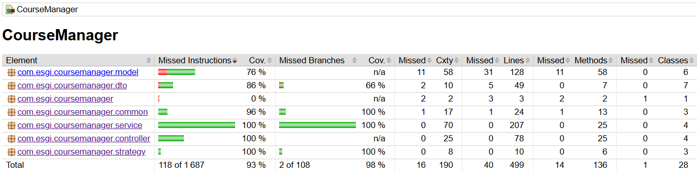

# 📚 CourseManager

Application RESTful de gestion de cours, étudiants, enseignants et inscriptions.

---

## 🚀 Démarrage rapide

### 1. Cloner le projet

```bash
git clone https://github.com/guilliammrst/CourseManager
cd coursemanager
```

---

### 2. Démarrage de la base de données (Docker)

```bash
docker-compose up -d
```

---

### 3. Démarrage de l’application

```bash
mvn spring-boot:run
```

---

### 4. Accès

- API : http://localhost:8080  
- Swagger : http://localhost:8080/swagger-ui.html  

---

## 🏗️ Architecture

```
controller → service → repository → database
```

---

## 🧠 Design Patterns

- Repository Pattern  
- Service Layer  
- DTO Pattern  
- Result Pattern  
- Strategy Pattern (optionnel)  
- Dependency Injection  

---

## 🔌 API

### Students
- GET /students  
- GET /students/{id}  
- POST /students  
- PUT /students/{id}  
- DELETE /students/{id}  

### Teachers
- GET /teachers  
- GET /teachers/{id}  
- POST /teachers  
- PUT /teachers/{id}  
- DELETE /teachers/{id}  

### Courses
- GET /courses  
- GET /courses/{id}  
- POST /courses  
- PUT /courses/{id}  
- DELETE /courses/{id}  

### Enrollments
- POST /enrollments  
- PUT /enrollments/{id}  
- DELETE /enrollments/{id}  

---

## 🧪 Tests unitaires

L’application est couverte par une suite complète de tests unitaires, garantissant la fiabilité des composants critiques sans dépendre d’une base de données ou du contexte Spring complet.

### 📊 Couverture  
✅ 93% de couverture globale des lignes de code  
✅ 100% des couches critiques couvertes :
- Controllers (API REST)
- Services (logique métier)
- Strategies (règles métier sensibles)



### 🎯 Objectifs
- Vérifier la logique métier isolée
- Garantir la stabilité des endpoints REST
- Tester les cas limites et erreurs
- Éviter les régressions lors des évolutions

### ⚙️ Technologies utilisées
- JUnit 5
- Mockito
- AssertJ

### 🧩 Approche
- Les controllers sont testés avec des services mockés
- Les services sont testés indépendamment des repositories
- Les strategies sont testées comme unités de logique pure
- Aucun accès à la base de données (tests rapides et déterministes)

### 📈 Pourquoi c’est important ?

Les modules les plus sensibles (controllers, services, strategies) étant couverts à 100%, cela garantit :
- 🔒 Une robustesse élevée de l’application
- ⚡ Des tests rapides (pas de Spring Boot lancé)
- 🔁 Une évolution sécurisée du code

---

## 🗄️ Base de données

- PostgreSQL (Docker)
- Hibernate auto-create :

```properties
spring.jpa.hibernate.ddl-auto=create
```

---

## ⚙️ Configuration

```properties
spring.datasource.url=jdbc:postgresql://localhost:5432/mydatabase
spring.datasource.username=myuser
spring.datasource.password=secret
```

---

## 📌 Auteur

Projet réalisé dans le cadre d’un cursus ESGI par Guilliam MORISSET et Elouan LE BRAS.
